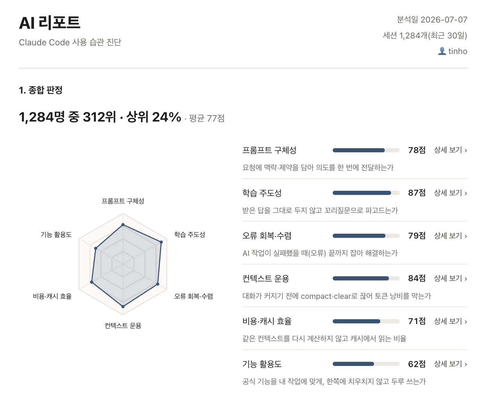

## 🧠 AI 철학

### 🤸🏻 AI 생활 체조 원칙

<table>
  <tr>
    <th nowrap width="1200">구분</th>
    <th width="9999">원칙</th>
  </tr>
  <tr>
    <td nowrap width="220"><b>무엇을 위해</b></td>
    <td width="9999">1. 기술은 늘 문제를 풀기 위한 수단이었고 AI도 다르지 않기에, 내가 붙드는 건 여전히 문제 그 자체다</td>
  </tr>
  <tr>
    <td rowspan="5" nowrap width="220"><b>어떻게 쓰고, 어떻게 성장하는가</b></td>
    <td>2. 과정까지 다 알아야 믿을 수 있는 게 아니라, 결과가 내가 원하는 모습이면 그걸로 충분하다</td>
  </tr>
  <tr><td>3. 내가 원하는 대로 나오게 하려면, 스크립트(지시)부터 정확히 써야 한다</td></tr>
  <tr><td>4. 스크립트만으로 부족할 때는, AI가 제공하는 도구들까지 적극 활용한다</td></tr>
  <tr><td>5. 스크립트와 도구가 아무리 좋아져도, 결과를 판별하는 기준은 결국 내 실력이다</td></tr>
  <tr><td>6. 스크립트 쓰기, 도구 쓰기, 판단하기를 반복하면서, 하나하나 더 잘하려고 애쓴다 (3 → 4 → 5 → 3)</td></tr>
  <tr>
    <td rowspan="3" nowrap width="220"><b>무엇을 지키는가 (학습과 정확함)</b></td>
    <td>7. 내가 이해하지 못한 도메인과 요구사항은 AI에게 맡기지 않는다</td>
  </tr>
  <tr><td>8. 정확히 설명해야 하는 것은 AI를 멀리하고 내 손으로 정리한다</td></tr>
  <tr><td>9. AI는 학습을 도울 수 있지만, 이해하는 과정은 대신하지 못한다</td></tr>
</table>

> [각 원칙의 자세한 설명] → <a href="https://github.com/johnprk-AI/ai-calisthenics"><b>AI 생활 체조 원칙</b></a>

 
 
 

## 🖥 앱

### 🐼 토큰 지키미 (Token Guardians)

<table>
  <tr>
    <td rowspan="10" width="44%"></td>
    <td width="20%"><b>소개</b></td>
    <td>Claude · Codex의 토큰 잔량을 메뉴바와 데스크탑 캐릭터로 실시간으로 보여주는 앱입니다. 질문을 보내면 5분 프롬프트 캐시 타이머가 돌아, 캐시 골든타임을 놓치지 않게 챙겨줍니다.</td>
  </tr>
  <tr><td rowspan="3"><b>기능</b></td><td>데스크탑 캐릭터(펫) 및 메뉴바로 잔량 시각화</td></tr>
  <tr><td>5분 프롬프트 캐시 타이머</td></tr>
  <tr><td>6종 캐릭터 개발 (판다 · 고양이 · 햄스터 · 강아지 · 하마 · 병아리)</td></tr>
  <tr><td><b>지원 OS</b></td><td>macOS 11+ (서명 · 공증 완료) &nbsp;·&nbsp; Windows 11+</td></tr>
  <tr><td><b>개발 기간</b></td><td>2026.04 ~ 진행 중</td></tr>
  <tr><td><b>버전</b></td><td><code>v2.35.0</code></td></tr>
  <tr><td><b>소개 페이지</b></td><td><a href="https://johnprk.github.io/token-guardians/"> 소개 페이지</a></td></tr>
  <tr><td><b>회고</b></td><td><a href="https://johnprk.github.io/app/">회고 페이지</a></td></tr>
  <tr><td><b>제작</b></td><td>개발 : <b>Claude Code</b> 디자인 : <b>Gemini</b></td></tr>
</table>

 

### 📊 AI 리포트 (ai-usage-checkup)

<table>
  <tr>
    <td rowspan="11" width="44%"></td>
    <td width="20%"><b>소개</b></td>
    <td>Claude Code · Codex를 얼마나 잘 쓰고 있는지 진단해주는 데스크탑 앱입니다. 내 컴퓨터에 남는 세션 로그를 전부 로컬에서 분석해 6축 점수 리포트를 만들고, 세션 내용·프롬프트는 어디로도 전송되지 않습니다.</td>
  </tr>
  <tr><td rowspan="4"><b>기능</b></td><td>6축 점수 진단 (프롬프트 구체성 · 학습 주도성 · 오류 회복 등, 축별 점수 기준 공개)</td></tr>
  <tr><td>핵심 지표 (토큰량 · 캐시 적중률 · 예상 비용 · 모델 믹스)</td></tr>
  <tr><td>사용 내역 분류 (대화 내용으로 작업 의도 분석) · CLAUDE.md · 스킬 · 훅 인벤토리</td></tr>
  <tr><td>익명 랭킹 (동의 시, LOL식 9티어 · 리더보드) · PDF 저장 · 점수 추이</td></tr>
  <tr><td><b>지원 OS</b></td><td>macOS (App Store 출시 · 서명 · 공증 완료) &nbsp;·&nbsp; Windows</td></tr>
  <tr><td><b>개발 기간</b></td><td>2026.06 ~ 진행 중</td></tr>
  <tr><td><b>버전</b></td><td><code>v0.9.5</code></td></tr>
  <tr><td><b>소개 페이지</b></td><td><a href="https://johnprk.github.io/ai-usage-checkup/">소개 페이지</a></td></tr>
  <tr><td><b>회고</b></td><td><a href="https://johnprk.github.io/ai-report/">회고 페이지</a></td></tr>
  <tr><td><b>제작</b></td><td>개발 : <b>Claude Code</b></td></tr>
</table>

 
 
 

## ⚙️ AI 도구

### 🤖 Skills

<table>
  <tr>
    <th nowrap>스킬</th>
    <th nowrap>분류</th>
    <th width="9999">하는 일</th>
    <th nowrap>사용 방식</th>
    <th nowrap>상태</th>
  </tr>
  <tr>
    <td nowrap><a href="https://github.com/johnprk-AI/skills/tree/main/mission-retrospective"><code>mission-retrospective</code></a></td>
    <td nowrap align="center">✍️ 글쓰기</td>
    <td>미션 · 프로젝트 회고 글 작성</td>
    <td nowrap>인터랙티브</td>
    <td nowrap align="center">사용 중</td>
  </tr>
  <tr>
    <td nowrap><a href="https://github.com/johnprk-AI/skills/tree/main/tech-learning-note"><code>tech-learning-note</code></a></td>
    <td nowrap align="center">✍️ 글쓰기</td>
    <td>기술 노트 글 작성</td>
    <td nowrap>위임</td>
    <td nowrap align="center">사용 중</td>
  </tr>
  <tr>
    <td nowrap><a href="https://github.com/johnprk-AI/skills/tree/main/mission-pre-study"><code>mission-pre-study</code></a></td>
    <td nowrap align="center">✍️ 글쓰기</td>
    <td>우테코 사전학습 · 토론 산출물 작성</td>
    <td nowrap>워크플로우</td>
    <td nowrap align="center">다듬는 중</td>
  </tr>
  <tr>
    <td nowrap><a href="https://github.com/johnprk-AI/skills/tree/main/panda"><code>panda</code></a></td>
    <td nowrap align="center">🛠️ 자동화</td>
    <td>기능 · 버전 체크리스트 관리</td>
    <td nowrap>워크플로우</td>
    <td nowrap align="center">사용 중</td>
  </tr>
  <tr>
    <td nowrap><a href="https://github.com/johnprk-AI/skills/tree/main/skin-sheet-split"><code>skin-sheet-split</code></a></td>
    <td nowrap align="center">🛠️ 자동화</td>
    <td>캐릭터 8포즈 시트 → 스킨 분할 · 정렬</td>
    <td nowrap>위임</td>
    <td nowrap align="center">사용 중</td>
  </tr>
  <tr>
    <td nowrap><a href="https://github.com/johnprk-AI/skills/tree/main/algo-study"><code>algo-study</code></a></td>
    <td nowrap align="center">🎓 학습</td>
    <td>백준 알고리즘 소크라테스식 러너</td>
    <td nowrap>인터랙티브</td>
    <td nowrap align="center">사용 중</td>
  </tr>
</table>

> [전체 스킬 Source] → <a href="https://github.com/johnprk-AI/skills"><b>johnprk-AI/skills</b></a> 
 
 

### 🪝 Hooks

<table>
  <tr>
    <th nowrap>훅</th>
    <th nowrap>시점</th>
    <th width="9999">하는 일</th>
    <th nowrap>상태</th>
  </tr>
  <tr>
    <td nowrap><a href="https://github.com/johnprk-AI/hooks/blob/main/retro-lint.py"><code>retro-lint</code></a></td>
    <td nowrap>Write · Edit 직후</td>
    <td>회고 · 블로그 문체 lint (em dash · 문학체 차단)</td>
    <td nowrap align="center">사용 중</td>
  </tr>
  <tr>
    <td nowrap><a href="https://github.com/johnprk-AI/hooks/blob/main/gradle-bg-guard.py"><code>gradle-bg-guard</code></a></td>
    <td nowrap>Bash 실행 전</td>
    <td>gradle 명령 백그라운드 실행 가드</td>
    <td nowrap align="center">사용 중</td>
  </tr>
  <tr>
    <td nowrap><a href="https://github.com/johnprk-AI/hooks/blob/main/notify-stop.sh"><code>notify-stop</code></a></td>
    <td nowrap>턴 종료 시(Stop)</td>
    <td>작업 끝나면 마지막 프롬프트를 폰으로 푸시</td>
    <td nowrap align="center">사용 중</td>
  </tr>
</table>

> [전체 훅 Source] → <a href="https://github.com/johnprk-AI/hooks"><b>johnprk-AI/hooks</b></a>

 
 

### 🛠️ Rules(CLAUDE.md, ...)

<table>
  <tr>
    <th nowrap>범위</th>
    <th nowrap>어디서 로드</th>
    <th width="9999">담은 규칙</th>
  </tr>
  <tr>
    <td nowrap><a href="https://github.com/johnprk-AI/claude-md/blob/main/global/CLAUDE.md"><code>global</code></a></td>
    <td nowrap>모든 세션</td>
    <td>회고 · 블로그 글쓰기 규칙 (em dash 금지 · 평범한 어휘 · 완결형 문장 · before/after 코드)</td>
  </tr>
  <tr>
    <td nowrap><a href="https://github.com/johnprk-AI/claude-md/blob/main/woowacourse/CLAUDE.md"><code>woowacourse</code></a></td>
    <td nowrap>우테코 미션 레포</td>
    <td>Java 작업 규칙 (커밋 메시지 · diff 보여주기 · 커밋 자동금지 · import 레이아웃 · 테스트 네이밍)</td>
  </tr>
</table>

> [규칙 Source] → <a href="https://github.com/johnprk-AI/claude-md"><b>johnprk-AI/claude-md</b></a>

 
